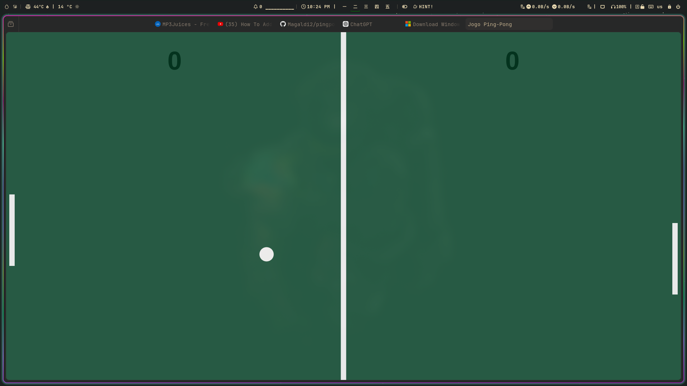

# Jogo Ping-Pong

Um jogo simples de Ping-Pong desenvolvido com HTML e JavaScript, utilizando a biblioteca Canvas.

## Descrição

Este projeto é uma implementação básica de um jogo de Ping-Pong. Ele foi desenvolvido como parte de um portfólio de projetos para demonstrar habilidades em HTML e JavaScript.

## Funcionalidades

- Jogo de Ping-Pong jogável no navegador.
- Controles simples utilizando o mouse.
- Animação suave utilizando `requestAnimationFrame`.
- Pontuação para jogador humano e computador.

## Como Executar

1. Clone este repositório:
   ```sh
   git clone https://github.com/seu-usuario/ping-pong-jogo.git
   ```
2. Navegue até o diretório do projeto:
   ```sh
   cd ping-pong-jogo
   ```
3. Abra o arquivo `index.html` em um navegador.

## Captura de Tela



## Código

Aqui está uma visão geral do código principal:

```html
<!DOCTYPE html>
<html lang="en">
  <head>
    <meta charset="UTF-8" />
    <meta http-equiv="X-UA-Compatible" content="IE=edge" />
    <meta name="viewport" content="width=device-width, initial-scale=1.0" />
    <title>Jogo Ping-Pong</title>
    <style>
      * {
        overflow: hidden;
        margin: 0;
        padding: 0;
      }
      body {
        display: flex;
        justify-content: center;
        align-items: center;
        background: #000;
      }
      canvas {
        border: 2px solid #fff;
      }
    </style>
  </head>
  <body>
    <canvas></canvas>
    <script>
      // código JavaScript aqui
    </script>
  </body>
</html>
```

## Contribuição

Contribuições são bem-vindas! Sinta-se à vontade para abrir uma issue ou enviar um pull request.


## Contato

- GitHub: [Magaldi2](https://github.com/Magaldi2)
- Email: magaldlucas6@gmail.com